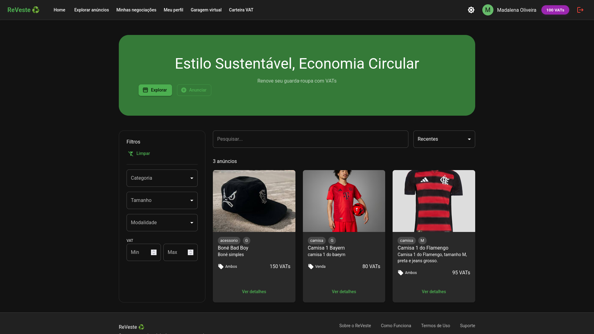
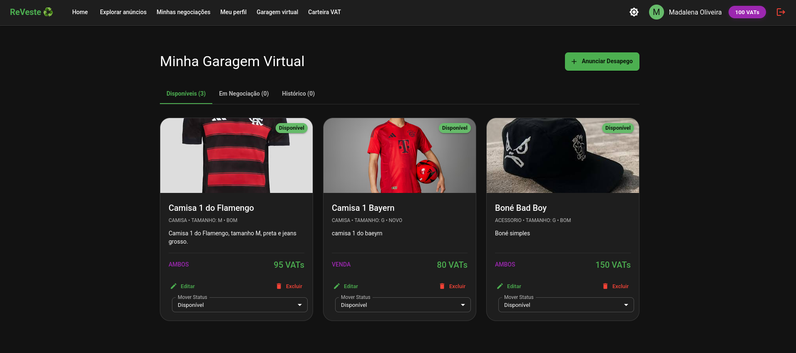
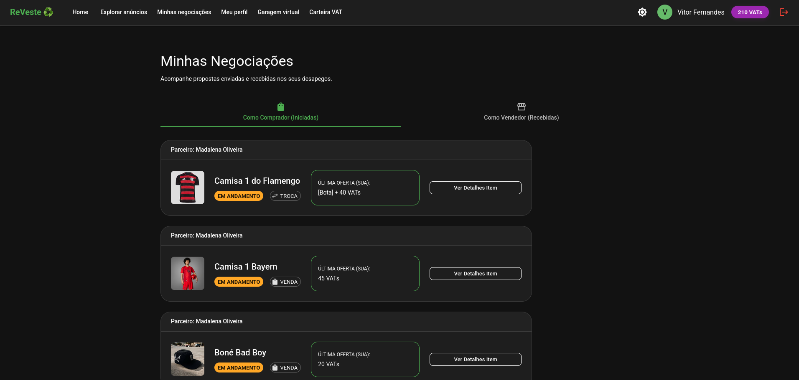
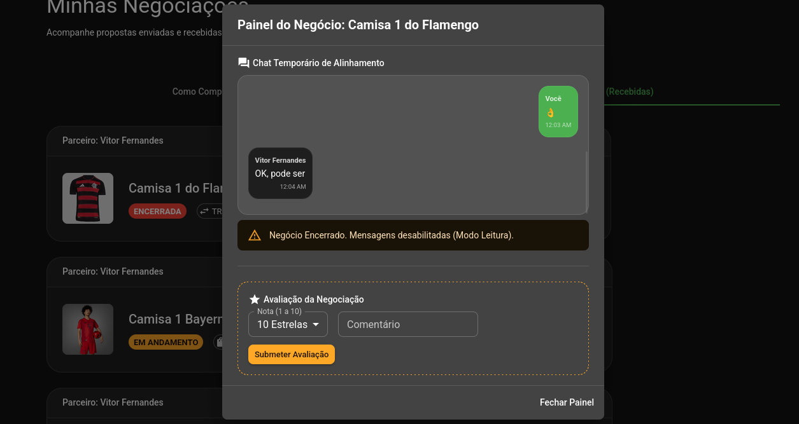
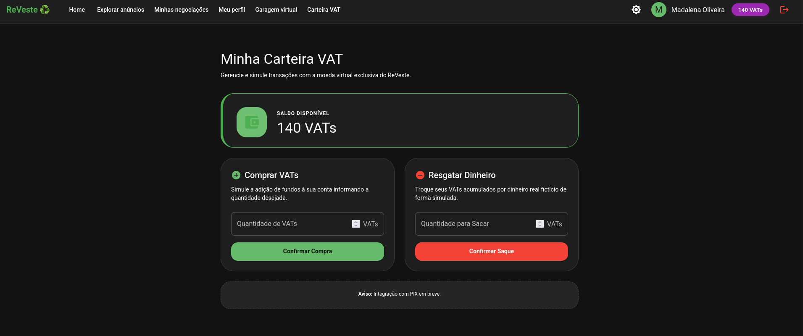

# ReVeste — Brechó Online com Negociação e Troca

## 📌 Sobre o Projeto
O **ReVeste** é uma plataforma front-end de brechó online focada no consumo consciente, sustentabilidade e economia circular. O sistema permite que os usuários anunciem peças de vestuário usadas para venda, troca direta ou ambas as modalidades, contando com um sistema dinâmico de propostas, contrapropostas, chat temporário e uma moeda virtual própria chamada **VAT**.

Este projeto foi desenvolvido como **Projeto Final** para a disciplina de Projeto de Desenvolvimento Web 1 no **IFCE**. Como requisito do projeto, a aplicação opera exclusivamente no lado do cliente (front-end), utilizando o `localStorage` do navegador para a simulação e persistência completa do banco de dados (usuários, anúncios, propostas, chats e avaliações).

---

## Equipe Desenvolvedora (Equipe 05)
* **Wallyson Santos Souza**
* **Mario Lucas de Almeida Silva**
* **Eric Levi Ribeiro Gomes**
* **Ana Caroline Gomes Carneiro**
* **Joao Vitor Moura Leite Lima**

**Curso:** Sistemas de Informaçao 
**Instituição:** Instituto Federal de Educação, Ciência e Tecnologia do Ceará (IFCE)  
**Orientador:** Prof. Samuel Araújo

---

## Tecnologias e Ferramentas Utilizadas
* **React** 
* **JavaScript (ES6+)** (Lógica de negócios e manipulação de estados)
* **CSS3** (Estilização avançada e responsividade)
* **LocalStorage API** (Persistência completa de dados em ambiente client-side)
* **React Router Dom** (Gerenciamento de rotas e navegação da SPA)
* **MUI Icons** (Biblioteca de ícones para a interface)
* **Git & GitHub** (Controle de versão e colaboração)

---

## Funcionalidades Implementadas

### 🔹 Funcionalidades Obrigatórias (100% Concluídas)
1.  **Autenticação Simulada:**
    * Tela de login e cadastro simplificada (sem validação real de servidor).
    * Persistência do estado de login no `localStorage` (usuário permanece logado até clicar em "Sair").
    * Perfil do usuário completo contendo: Nome, E-mail, Telefone, Endereço, Foto de Avatar e Saldo de VATs.
2.  **Cadastro e Listagem de Anúncios:**
    * Formulário completo com validações para criação de anúncios: título, descrição, categoria (camisa, calça, calçado, acessório, etc), tamanho (PP ao GG), estado de conservação (Novo, Bom, Regular, Marcas de uso), URL da foto e modalidade (Venda, Troca ou Ambos).
    * Atribuição de valor monetário real e valor equivalente na moeda fictícia **VAT**.
    * Tela central "Explorar Anúncios" com barra de busca por texto (título/descrição) e filtros combinados por categoria, tamanho, modalidade e faixa de preço/VATs.
3.  **Moeda Virtual VAT (Valor para Troca):**
    * Carteira digital onde cada usuário começa com 0 VATs.
    * Mecanismo de simulação para "Comprar VATs" com dinheiro real e "Sacar VATs" de volta para dinheiro real.
    * Lógica algorítmica de equivalência em trocas puras: o sistema calcula se a diferença entre as peças propostas é de no máximo 20%. Caso ultrapasse, exibe uma recomendação visual sugerindo uma peça complementar ou saldo em VATs para equilibrar a oferta (sem bloquear a operação).
4.  **Sistema de Propostas e Negociação:**
    * Envio de propostas personalizadas de acordo com a modalidade (oferta em dinheiro para venda ou seleção de até 5 peças da própria garagem + VATs adicionais para troca).
    * Painel do vendedor para interagir com a proposta: **Aceitar**, **Recusar** ou **Contrapropor** (gerando um novo ciclo de valores).
    * Histórico completo da negociação exibido em uma linha do tempo (*timeline*) intuitiva.
5.  **Chat Temporário da Negociação:**
    * Geração automática de uma sala de chat exclusiva assim que uma proposta é aceita.
    * Troca de mensagens de texto com registro de data/hora simulados e botão de encerramento.
    * Regra de expiração visual/lógica programada para manter o chat disponível por até 7 dias após a conclusão ou cancelamento.
6.  **Garagem Virtual:**
    * Área exclusiva de gestão do acervo do usuário dividida em 3 abas dinâmicas: *Disponível* (anúncios ativos), *Negociação* (itens vinculados a propostas ativas) e *Trocado/Vendido* (histórico de movimentações).
    * Opção de movimentação e gerenciamento manual dos estados dos itens.
7.  **Avaliação Pós-Negociação:**
    * Fluxo de avaliação ativado imediatamente após o encerramento da negociação.
    * Sistema de nota de 1 a 10 estrelas e campo para comentário opcional.
    * Atualização em tempo real do perfil do usuário com a média aritmética das estrelas recebidas e contador de negociações bem-sucedidas.
8.  **Layout e Responsividade:**
    * Interface limpa, moderna e focado na usabilidade de um e-commerce real.
    * Totalmente responsivo, adaptando-se perfeitamente de telas mobile (375px+) a monitores desktop (1024px+).
    * Menu de navegação integrado com acesso rápido para: *Home, Explorar Anúncios, Meu Perfil, Minhas Negociações e Sair*.

### 🔸 Funcionalidades Opcionais / Diferenciais (Implementadas)
* 🌙 **Modo Escuro (Dark Mode) Persistente:** Alternância de tema integrada no cabeçalho, salvando a preferência do usuário diretamente no `localStorage` para que a escolha seja mantida em acessos futuros.
* ✨ **Animações Suaves:** Transições suaves em mudanças de páginas, feedbacks visuais ao passar o mouse em cards (*hover*), abertura de modais e alertas interativos de sucesso/erro para enriquecer a experiência do usuário (UX).

---

## Demonstração Visual (Telas Principais)


### 1. Tela de Início (Home),  Explorar Anúncios, Filtros Avancados & Modo Escuro

*Legenda: Apresentação inicial da plataforma ReVeste com suporte a Dark Mode.*


### 2. Garagem Virtual e Fluxo de Propostas




### 4. Chat de Negociação e Sistema de VATs



---

## Como Instalar e Executar o Projeto Localmente

Siga os passos abaixo para clonar o repositório e rodar a aplicação em sua máquina local:

1.  **Clonar o Repositório:**
    ```bash
    git clone git@github.com:WallysonCR/projeto-final-brecho-online.git
    cd projeto-final-brecho-online
    ```

2.  **Instalar as Dependências:**
    Certifique-se de ter o [Node.js](https://nodejs.org/) instalado em sua máquina. No diretório raiz do projeto, execute:
    ```bash
    npm install
    ```

3.  **Iniciar o Servidor de Desenvolvimento:**
    Para rodar a aplicação localmente pelo script do Create React App ou Vite, utilize:
    ```bash
    npm start
    ```

4.  **Acessar a Aplicação:**
    Abra o seu navegador e acesse: [http://localhost:4175](http://localhost:4175) (ou a porta indicada no terminal).

---

## Dificuldades Encontradas e Soluções Adotadas

Durante o ciclo de desenvolvimento do **ReVeste**, a equipe enfrentou alguns desafios de arquitetura front-end devido à ausência de um banco de dados relacional tradicional. Abaixo estão detalhadas as principais dificuldades e como foram superadas:

1.  **Dificuldade: Simulação de Relacionamentos Complexos no LocalStorage**
    * *Desafio:* Gerenciar dados interligados, como associar uma proposta específica a um anúncio, identificar quem é o proponente e o receptor, e manter um histórico de mensagens em formato de chat sem duplicar dados ou causar inconsistências.
    * *Solução:* Criamos uma estrutura de dados normalizada dentro do `localStorage`. Cada entidade (usuários, anúncios, propostas) possui uma chave própria com objetos contendo IDs únicos gerados dinamicamente. No front-end, utilizamos funções do JavaScript para realizar os "joins" lógicos em tempo de execução, garantindo que as atualizações em um anúncio ou perfil se refletissem imediatamente em todas as telas correlacionadas.

2.  **Dificuldade: Sincronização do Estado do Modo Escuro e Temas**
    * *Desafio:* Garantir que a alternância entre o modo claro e escuro funcionasse de forma global na aplicação sem causar atrasos visuais (*flickering*) na renderização inicial da página.
    * *Solução:* Implementamos um Contexto React (`ThemeContext`) combinado com variáveis nativas do CSS. O estado inicial do tema verifica a preferência salva no `localStorage` antes da renderização do componente principal, proporcionando uma experiência de transição instantânea e persistente.

3.  **Dificuldade: Regras de Validação Matemáticas para Trocas de VATs**
    * *Desafio:* Aplicar de forma amigável a regra de negócios que exige o cálculo da margem de 20% de diferença de valor entre peças em uma troca direta, sugerindo complementos de forma não obstrutiva.
    * *Solução:* Desenvolvemos uma sub-rotina utilitária em JavaScript que calcula a diferença absoluta percentual toda vez que um usuário seleciona peças para propor uma troca. Se a variação for superior a 20%, a interface exibe dinamicamente uma mensagemm de alerta amarelo  e um atalho para a inclusão de VATs como saldo complementar, mantendo a flexibilidade exigida pelo escopo do projeto.

---

## Vídeo de Apresentação
O vídeo demonstrativo com a explicação do código e o fluxo de uso completo da plataforma (duração entre 3 e 5 minutos) pode ser assistido através do link abaixo:
**[Link para o Vídeo no YouTube / Drive](#)** 
